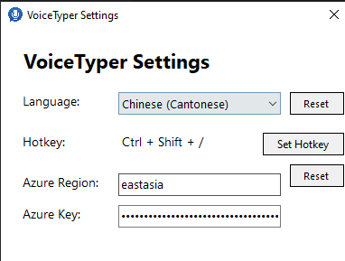

# VoiceTyper




VoiceTyper is a Windows application that enables voice-to-text input using Microsoft Azure's Speech Services. Simply press a hotkey and start speaking - your words will be typed automatically!

## ⬇️ Quick Download

1. Go to the [Releases](https://github.com/palmasop/VoiceTyper/releases) page
2. Download the latest `VoiceTyper_Setup.exe`
3. Run the installer and follow the prompts
4. Launch VoiceTyper from the Start Menu or desktop shortcut

The installer will:

- Install VoiceTyper to Program Files
- Create Start Menu shortcuts
- Add desktop shortcut (optional)
- Register for automatic updates

System Requirements:

- Windows 10 or later
- .NET 6.0 Runtime (automatically installed if needed)
- Microphone for voice input

[View All Releases](https://github.com/palmasop/VoiceTyper/releases) | [Report Bug](https://github.com/palmasop/VoiceTyper/issues)

## Features

- Voice-to-text typing in multiple languages:
  - Chinese (Cantonese)
  - Chinese (Mandarin)
  - English
- Customizable hotkey for starting/stopping voice input
- System tray integration
- Real-time speech recognition
- Secure Azure Speech Service configuration

## First-Time Setup

1. Get your Azure Speech Service credentials:

   - Create an [Azure Account](https://azure.microsoft.com/free/) if you don't have one
   - Create a [Speech Service resource](https://portal.azure.com/#create/Microsoft.CognitiveServicesSpeechServices)
   - Copy your resource's region and key

2. Configure VoiceTyper:
   - Right-click the tray icon
   - Select "Settings"
   - Enter your Azure region and key
   - Choose your preferred language
   - Or use the default shared credentials (limited usage)

## Usage

1. Press the default hotkey (Ctrl + Shift + /) to start voice input
   - You can change this in Settings
2. Start speaking
3. Press the hotkey again to stop

## Configuration

Access settings through the system tray icon:

- Language selection
- Hotkey configuration
- Azure Speech Service settings
- Debug logs access

## Uninstallation

### For MSI installation:

- Windows Settings > Apps > Apps & features > VoiceTyper > Uninstall
- Or Control Panel > Programs > Programs and Features > VoiceTyper > Uninstall

### For RAR version:

- Simply delete the extracted folder
- Delete any shortcuts you created
- Optional: Delete settings file from `%AppData%\VoiceTyper`

## Troubleshooting

If you encounter any issues:

1. Check the Debug Logs (accessible from system tray menu)
2. Make sure your microphone is working and allowed in Windows Privacy Settings
3. Verify your internet connection
4. Report issues on our GitHub repository

## Building from Source

### Prerequisites

- Visual Studio 2022 or later
- .NET 6.0 SDK
- Windows 10 or later
- WiX Toolset v4
- WiX Toolset Visual Studio 2022 Extension

### Build Steps

1. Clone the repository:

   ```bash
   git clone https://github.com/palmasop/VoiceTyper.git
   cd VoiceTyper
   ```

2. Build with Visual Studio:

   - Open `VoiceTyper.sln`
   - Build solution (F6)

3. Or build with .NET CLI:
   ```bash
   dotnet build
   ```

### Create Installer

1. Build the main project in Release configuration
2. Build the `installer_wix` project to generate the installer
3. The installer will be created at `installer_wix\bin\Release\VoiceTyper_Setup.exe`

You can also build everything at once using:

```bash
dotnet build -c Release
```

## Project Structure

```
VoiceTyper/
├── .github/            # GitHub workflows and configuration
├── VoiceTyper/         # Main application project
├── VoiceTyperSetup/    # WiX installer project
├── docs/              # Documentation
│   └── images/        # Screenshots and images
├── .gitignore
├── LICENSE
├── README.md
└── VoiceTyper.sln     # Solution file
```

## License

This project is licensed under the [MIT License](LICENSE)
